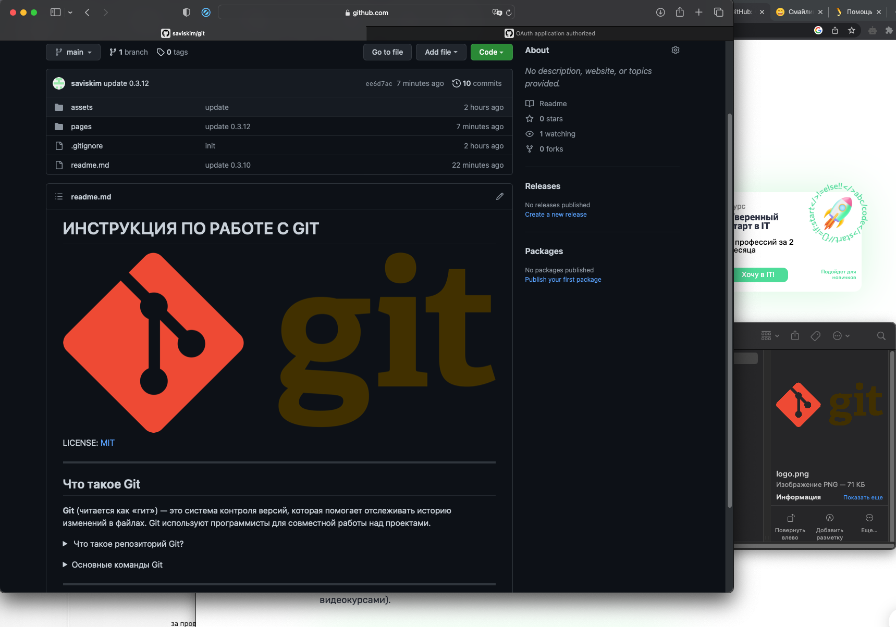

## GitHub

 

Проект в GitHub хранится в репозитории (repository) — коллекции всех изменений создаваемого кода. Если вы будете работать над проектом в одиночку — вам нужно создать новый репозиторий. Если в вашем проекте несколько разработчиков — каждый из них будет клонировать репозиторий первоначального создателя проекта.

Внутри репозитория изменения кода хранятся в виде веток и коммитов.

Коммит (commit) — основной объект разработки, в котором хранятся все изменения кода за итерацию. По сути, это список со всеми актуальными изменениями и ссылка на предыдущую версию коммита. У каждого коммита есть атрибуты: имя, дата создания, автор и комментарии к текущей версии (например, «Создал страницу courses.html» при разработке сайтов с видеокурсами).

[&#128072; На главную](../readme.md)